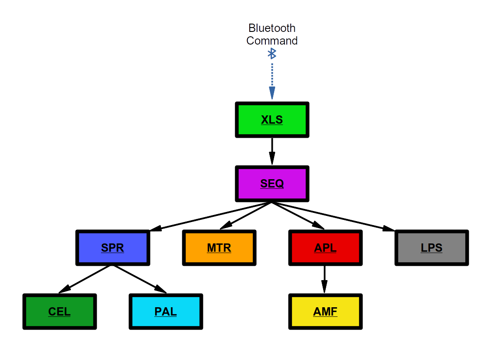

# Furby
## Python tools for handing Furby Connect DLC files

<p align="center">
	
</p>

**Disclaimer: This script is pretty alpha; use at your own risk. Bad DLCs can make your Furby Connect very unhappy.**

### The original blog post can be found [here](https://www.contextis.com/blog/dont-feed-them-after-midnight-reverse-engineering-the-furby-connect)


## DLC Class

This class is a wrapper around the syntax used by Furby Connect DLC files. To use it, add the line `from furby import dlc` to the top of your script:

```
#!/usr/bin/env python
# -*- coding: utf-8 -*-

from furby import dlc

def main():
    ...
    <your python here>
    ...
```

The class is most useful when instantiated with an existing Furby Connect DLC file. This can be done by passing the path to such a file when creating an instance of the class:

```
D = dlc("./dlc/dlc1/tu012700.dlc")
```

You can then access each of the various sections contained in the DLC via the `dlc_sections` dictionary:

```
# For example:
cels_section = D.dlc_sections["XLS"]
```

Each of the sections has a "main" storage object, which is either a list or a dictionary as appropriate to the section. Notable main storage objects are as follows:

```
xls_tree             = D.dlc_sections["XLS"].action_tree
colour_palettes      = D.dlc_sections["PAL"].palettes
eye_sprites          = D.dlc_sections["CEL"].cels
animation_scheduling = D.dlc_sections["SPR"].frame_playlists
composited_frames    = D.dlc_sections["SPR"].frames
audio_samples        = D.dlc_sections["AMF"].tracks
audio_playlists      = D.dlc_sections["APL"].playlists
lip_movements        = D.dlc_sections["LPS"].phrases
response_scheduling  = D.dlc_sections["SEQ"].sequences
servo_movements      = D.dlc_sections["MTR"].animations
```

For more information on what each section does and how they relate to one another, [check out our writeup](https://www.contextis.com/blog/dont-feed-them-after-midnight-reverse-engineering-the-furby-connect), which covers it in a fair amount of detail.

<p align="center">
	
</p>

After making modifications to a DLC, you can build it back into a new DLC file by calling the `build()` function, passing the path to the output file:

```
D.build("/tmp/new_dlc.dlc")
```


## Helper Functions

At its most basic level, the DLC class essentially breaks out the various data structures contained within a Furby DLC file into convenient Python data structures which can be handled and manipulated in a much more straightforward way. Modifying a DLC can be achieved by directly changing the content stored in each of these data structures, however we have also included several helper functions to make getting started with common tasks a much less burdensome experience.


### dump_cels(palette_index)
`dump_cels()` can be used to find and extract all the cels contained within a DLC, converting them to non-indexed 32-bit colour RGBA PNGs.

 - `palette_index` is the index of the palette to use for rendering the cels. Although individual cels require different palettes to be rendered correctly, for ease of use, this function only accepts one palette index at a time.

Here's an example:

```
# Dump cels using the 4th palette contained in the DLC.
D.dump_cels(4)

# Different cels use different palettes.
D.dump_cels(5)
D.dump_cels(3)
```

### dump_cels_monochrome()

As above, but attempts to use a monochrome palette if one is available. Useful for getting a quick overview of the cels contained within a DLC.

Here's an example:

```
# Dump cels (monochrome) has no mandatory arguments.
D.dump_cels_monochrome()
```

### replace_audio(action_code, audio_files)
`replace_audio()` can be used to change the audio files played back as part of a response to a particular action code. It works by modifying entries in the AMF section, without changing references in higher sections. As a single AMF entry might be referenced in several places, this function might not always work in exactly the way you'd expect.

 - `action_code` is a 4-tuple containing the action code whose audio response you'd like to change. For example, passing `(75,0,0,0)` will direct the function to work on the audio used as a response to action code 75-0-0-0.
 - `audio_files` is a list of paths to audio files you'd like to insert into the DLC. Note that these need to be a18-encoded.

Here's an example:
```
# Replace audio response to action code 75-0-0-0
D.replace_audio((75,0,0,0), ["my_audio_1.a18", "my_audio_2.a18", "my_audio_3.a18", "my_audio_4.a18"])

# If too many audio files are given, the function will start with the first one, and attempt to insert as many as possible into the specified response.
D.replace_audio((75,0,0,1), ["my_audio_1.a18", "my_audio_2.a18", "my_audio_3.a18", "my_audio_4.a18"])

# If too few audio files are given, the function will loop the last one as many times as it can.
D.replace_audio((75,0,0,1), ["my_audio_1.a18"])

```

### extract_palette()

`D.dlc_sections["PAL"].extract_palette()` will, if passed a .gif with a (single) 64-colour palette, extract that palette and convert it into the same format used as internal storage by the dlc class. This means you can do things like this:

```
# extract the palette from a gif
new_palette = D.dlc_sections["PAL"].extract_palette("./my_gif.gif")

# replace the nth palette in the DLC with this new palette
n = 5
D.dlc_sections["PAL"].palettes[n] = new_palette
```

### quarterize()

`D.dlc_sections["CEL"].quarterize()` will, if passed a 128x128 pixel .gif, convert that gif into a sequence of quarter-frames, in the same form as that used by the dlc class' internal storage. This means that you can do things like this:

```
# quarterize a gif
new_cels = D.dlc_sections["CEL"].quarterize("./my_gif.gif")

# replace the nth cel in the DLC with the mth of our new cels
n = 5
m = 3
D.dlc_sections["CEL"].cels[n] = new_cels[m]

# To view the quarters as they get made, just pass in a palette to render them with.
new_palette = D.dlc_sections["PAL"].extract_palette("./my_gif.gif")
new_cels = D.dlc_sections["CEL"].quarterize("./my_gif.gif", new_palette)
```

### replace_track()

`D.dlc_sections["AMF"].insert_track()` will replace one of the tracks in the AMF section with a track supplied by you. It can be used in the following way:

```
# Replace the nth audio track.
n = 9
D.dlc_sections["AMF"].replace_track(n, "mytrack.a18")
```

### minify_audio()

`D.dlc_sections["AMF"].minify_audio()` will shrink all the audio files in a DLC to a given length. This is useful if you're going to be testing multiple DLC files, as it will drastically shrink the size of your DLCs, resulting in faster uploads. You can use it like so:

```
# Shrink a DLC
D = dlc("./dlc/dlc1/tu012700.dlc")
D.dlc_sections["AMF"].minify_audio()
D.build("/tmp/minified_dlc.dlc")
```


## Contributing

We really hope you enjoy tinkering with the scripts. If you'd like to contribute, here are a few things that still need work:

 - Cataloguing the motions in the MTR section
 - Improving the `__compile__()` function of both the XLS and SPR sections to be more robust
 - Implementing an analogue of the GeneralPlus a18 codec in Python, for converting .wav file

Enjoy - we're looking forward to seeing what you make with it!

## Further Reading
- [Reverse Engineering the Furby Connect (Context IS Blog Post)](https://www.contextis.com/blog/dont-feed-them-after-midnight-reverse-engineering-the-furby-connect)
- [Paul Stone's FurBLE Web Bluetooth Controller](https://github.com/pdjstone/furby-web-bluetooth)
- [Jeija's Bluefluff project](https://github.com/Jeija/bluefluff)
- [L0ss & Swarley's Furbhax project](https://github.com/swarley7/furbhax)
- [Igor Afanasyev's Furby audio implementation](https://github.com/iafan/Hacksby)
